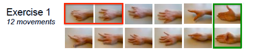
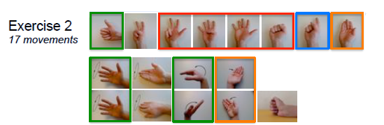
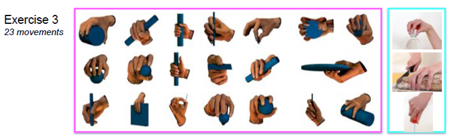
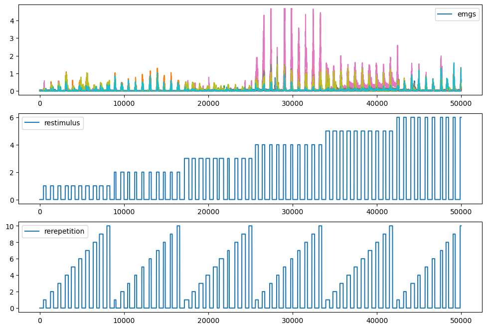
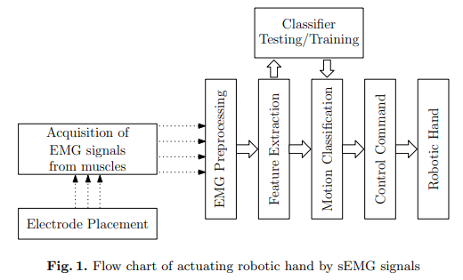

# Aprendizaje Automatico 1

## Base de datos

### Hardware empleado

|Descripción|Referencia|
|----|----|
|Equipo de computo|Dell Latitude E5520|
|Sistema de adquisición de datos|National Instruments 6023E [[link]](https://www.egr.msu.edu/classes/me855/radcliff/PCI-6023.pdf)|
|Sensores|<li> sEMG Electrodes: 10 double-differential Otto Bock 13E200 [[link]](https://shop.ottobock.ca/fr/Proth%C3%A8ses/Membre-sup%C3%A9rieur/Mains-myo-et-composants/El%C3%A9ments-de-contr%C3%B4le-de-la-proth%C3%A8se-myo%C3%A9lectrique/Electrodes/ELECTRODE--MYO/p/13E200%7E560#product-documents-section) <li> Data Glove 22 sensors Cyberglove II (Cyberglove Systems) [[link]](https://www.cyberglovesystems.com/cyberglove-ii/)  <li> Inclinometer: Kübler 8.IS40.2341|
|Otros|<li> Printed Circuit Board, Cables & Connectors|

## Ninapro

Las bases de datos de Ninapro (Non-Invasive Adaptive Prosthetics Database) son colecciones de datos que contienen información de señales de electromiografía (EMG) y otros sensores, diseñadas para investigar el control de prótesis mioeléctricas. Aquí presentamos una comparación de las bases de datos más comunes de Ninapro:

| Característica                | DB1   | DB2    | DB4    | DB5      |
|-----------------------------|-------|--------|-------|----------|
| **Año de publicación**        | 2012  | 2013   | 2015   | 2017     |
| **Sujetos**                   | 27   | 40 ()     |10     | 11       |
| **Numero de movimientos**       | 52    | 50     |40     | 67       |
|**Sensores sEMG**              |Ottobock 13E200-50|Delsys Trigno Wireless|Cometa miniWave + Dormo|Thalmic Myo (double & single)|
| **Número de canales EMG**     | 10    | 12  | 16     | 12    |

### Base de datos NinaPro DB1

En la siguiente pagina: https://ninapro.hevs.ch/instructions/DB1.html se encuentra la base de datos. La siguiente tabla resume cada una de las caracteristicas:

| **Características**            | **Descripción**                                                                 |
|--------------------------------|---------------------------------------------------------------------------------|
| **Participantes**              | 27 sujetos sanos  (mujeres y hombres)                                           |
| **Electrodos**                 | 10 electrodos de superficie colocados en el antebrazo                           |
| **Frecuencia de Muestreo**     | 100 Hz                                                                          |
| **Movimientos Registrados**    | 52 movimientos de mano y dedos (gestos básicos, isométricos y dinámicos)        |
| **Sensores Adicionales**       | Acelerómetro 3D para capturar datos de movimiento (ejes X, Y, Z)                |
| **Propósito**                  | Investigación para mejorar el control de prótesis de mano basada en señales EMG |
| **Duración de Cada Registro**  | Cada movimiento dura alrededor de 5 segundos                                    |
| **Etiquetas de Movimiento**    | Cada registro está etiquetado con el tipo de movimiento realizado               |

### Sensado

|Sensado|Conexión|
|---|---|
|Guante Dataglove|Bluetooth-tunneled serial port at a rate of 25Hz|
|Inclinometro|DAQ card sampling the signals at 100Hz.|
|sEMG electrodos|DAQ card sampling the signals at 100Hz.|

### Almacenamiento

* In order to give maximum data processing flexibility to the NINAPRO database user, we store
the data totally asynchronously, tagging each sample with
an accurate timestamp. Accurate timestamping on Windows
is enforced by the HRT library [37], whose precision is of
the order of magnitude of the microsecond. 
* The stimulus generator is then used to generate the labels for each sample,
as a further data stream running at 25Hz;

* Informacion asociada a cada muestra:
  * subject
  * exercise number
  * and movement index. 

* Informacion por sujeto:
  * Three data files are stored in plain ASCII format, containing
in turn the electrodes and inclinometer data, the Cyberglove
data, and the stimulus data (timestamp + the sensor values). 
  * Five pictures are also stored for each subject: 
    * three previews of the data of each exercise 
    * Two pictures of the forearm and of the hand with and without the acquisition setup. 
    * A record of the identity of all the subjects is kept, although
these private details are explicitly excluded from publication
and analysis.

* Sobre los registros: 

En la pagina https://ninapro.hevs.ch/instructions/DB1.html se enceuentran cad uno de los registros por usuario en un archivo comprimido de la forma **`Sx.zip`** (Donde **`x`** es el numero del usuario). 

Dentro de cada directorio comprimido hay tres archivos de la forma **`Sx_Ay_Ez.mat`** donde:
* **`x`**: Numero del sujeto.
* **`y`**: Adquisición (`A1`: Primera adquisición).
* **`z`**: Numero del ejercicio: 1, 2 o 3.
  * 27 sujetos (S1-S27)
  * 3 ejercicios por sujeto (E1-E3)
  * Formato de archivos: .mat y .zip
 

|Ejercicio|Movimientos|Descripción|
|----|----|----|
|1|12|Individuales de dedos|
|2|17|Agarres y posturas de mano|
|3|23|Gestos funcionales|

Movimientos 1

Movimientos 2

Movimientos 3

* The subject sits comfortably on an adjustable chair, in front of a table with a large screen.  
* The subjects are presented with short movies appearing on the screen and are asked to simply replicate the movements depicted in the movies as accurately as possible.
* Each subject:
  *  "training phase" to get familiar with the procedure, during which each movement of the first three classes and three movements of the fourth class are repeated three times (no data are recorded). 
  *  After the training phase, a sequential series of ten repetitions of each class of movements is presented to the subject while data are recorded. 
  *  Each movie lasts five seconds and three seconds
of rest are allowed in-between movements. The four movement classes are functionally grouped into three "exercises" (the second and third classes are grouped into the second exercise).

Notice that the sequences are intentionally not randomized in order to induce repetitive, almost unconscious movements. The three exercises are completed in 16, 23, and 31 minutes. In order to avoid muscle fatigue and its influence on the sEMG signal, 5 minutes of rest are allowed between the training sequence and the first exercise and between each exercise and the following one. In total, the experiment lasts about 100 minutes.

Las señales de los ejercicios se ven asi mas o menos:

En **Effect of Analysis Window and Feature Selection on Classification of Hand Movements Using EMG Signal** [[link]](https://web.lums.edu.pk/~imdad/pdfs/papers/20_08_effect_of_analysis_window.pdf) donde la siguiente figura muestra un diagrama:

**Para ver luego**: Open Database for Accurate Upper-Limb Intent Detection Using Electromyography and Reliable Extreme Learning Machines [[link]](https://pdfs.semanticscholar.org/0cb0/b903a98b04f6afef9d4304a913fcbe049086.pdf)

### Enlaces a la loca

* https://repositorio.ul.pt/bitstream/10451/30535/1/ulfc120811_tm_Alexandre_Calado.pdf
* https://oa.upm.es/72198/4/TFG_NOEMI_AMOROS_SPOONER.pdf
* https://www.hevs.ch/media/document/0/2012.05.21_ninapro_en.pdf?107d541d8bbbe739caeec09168c22859
* https://github.com/parasgulati8/NinaPro-Helper-Library
* https://github.com/cnzero/NinaproCNN/tree/master
* https://github.com/Lif3line/nina_helper_package_mk2
* https://github.com/sebastiankmiec/NinaTools
* https://github.com/sun2009ban/divide_NinaPro_database_5
* https://github.com/nagaswathi-a/DB1-Ninapro-sEMG-Classification-
* https://github.com/tsagkas/sEMG-HandGestureRecognition
* https://github.com/louisc-s/Machine-Learning-Technologies-on-EMG-for-Hand-Gesture-Recognition
* https://github.com/increase24/Ninapro-dataset-processing

<!-- 

The acquisition setup included several sensors, designed to record hand kinematics, dynamics and the corresponding muscular activity. The sensors were connected to a laptop responsible for data acquisition
* **Hand kinematics**:
  * 22-sensor CyberGlove II dataglove ([link](https://www.cyberglovesystems.com/cyberglove-ii))
* **Hand dynamics**:
  * Finger-Force Linear Sensor (FFLS)
* **Muscular activity**:
  * OttoBock or Delsys double-differential sEMG electrodes

Información del archivo de matlab:

* subject: subject number
* exercise: exercise number
* emg: sEMG signal of the electrodes; columns 1–8 include the signal from the electrodes equally spaced around the forearm; columns 9 and 10 include the signal from the electrodes located on the main activity spots of the muscle Flexor Digitorum Superficialis and of the muscle Extensor Digitorum Superficialis14; when available, columns 11 and 12 include the signal from the main activity spots of the muscle Biceps Brachii and of the muscle Triceps Brachii; 
* acc (36 columns): (x,y,z)-axis acceleration values of the 12 electrodes; 
* glove (22 columns): uncalibrated signal from the 22 sensors of the Cyberglove. The raw data are declared to be proportional to the angles of the joints in the CyberGlove manual; details on the location of the sensors are available at the link: ninapro.hevs.ch/node/123; 
* inclin (2 columns): inclinometer (roll,pitch) values; 
* stimulus (1 column): the original label of the movement repeated by the subject; 
* restimulus (1 column): the a-posteriori refined label of the movement; 
* repetition (1 column): stimulus repetition index; 
* rerepetition (1 column): restimulus repetition index; 
* force (6 columns): force values;
* forcecal (2 × 6 values): maximal force values (minimal and maximal force values for each sensor).
----

To verify that the data allow the recognition of hand movements, we apply four state-of-the-art
classification methods on five signal features using an approach that is very common in the field of
sEMG. In this section, we also compare the classification accuracy obtained on subsets of movements that
were previously described in literature

---

https://www.nature.com/articles/sdata201453.pdf

| **Electrodos de movimiento**  | Guante de datos de 22 sensores  | Guante de datos de 22 sensores | Guante de datos de 22 sensores | Sin guante                           | Guante de datos de 22 sensores       |
| **Otros sensores**             | Acelerómetro, giroscopio, posición   | Acelerómetro, giroscopio, posición   | Acelerómetro, giroscopio, posición   | Acelerómetro, giroscopio             | Acelerómetro, giroscopio, posición   |

## Aplicaciones
Estas bases de datos se utilizan comúnmente para investigaciones en:
- Control de prótesis mioeléctricas.
- Reconocimiento de gestos y movimientos de la mano.
- Desarrollo de interfaces de usuario basadas en EMG.
- 

Often, non-invasive methods are based on the use of several electrodes to record sEMG, and pattern recognition algorithms to classify the movement that the subject is willing to perform, and recently, such a system has been clinically deployed 

https://coaptengineering.com/

e Ninapro (Non Invasive Adaptive Prosthetics) database (Data Citations 1
and 2), which includes data acquired from 67 intact subjects and 11 hand-amputated subjects while
performing several repetitive tasks such as hand movements and finger force patterns. The database aims at allowing worldwide research groups to study the relationship between sEMG, hand/arm kinematics
and dynamics, and clinical parameters, with the final goal of creating non-invasive, naturally controlled robotic hand prostheses for trans-radial amputees

Some parts of the
database have already been used in traditional scientific papers on intact subjects14,19 with the aim of
characterizing pre-processing and classification procedures, clinical parameters, and introducing the
Movement Error Rate as an alternative to the standard window-based accuracy.

. The first database contains data obtained from 27 intact subjects (20 males, 7 females; 25 right
handed, 2 left handed; age 28±3.4 years). The second database contains data obtained from 40 intact
subjects (28 males, 12 females; 34 right handed, 6 left handed; age 29.9±3.9 years). The third database
contains data obtained from 11 trans-radial amputated subjects (11 males; 10 right handed, 1 left handed;
age 42.36±11.96 years)

-->

### Referencias

1. https://sites.google.com/view/ts-clasp
2. https://www.sktime.net/en/latest/examples/annotation/segmentation_with_clasp.html
3. https://www.datacamp.com/tutorial/tpot-machine-learning-python
4. https://epistasislab.github.io/tpot/installing/
5. https://epistasislab.github.io/tpot/
6. https://automl.github.io/auto-sklearn/master/
7. https://www.analyticsvidhya.com/blog/2022/02/auto-sklearn-accelerate-your-machine-learning-models-with-automl/
8. https://machinelearningmastery.com/auto-sklearn-for-automated-machine-learning-in-python/

